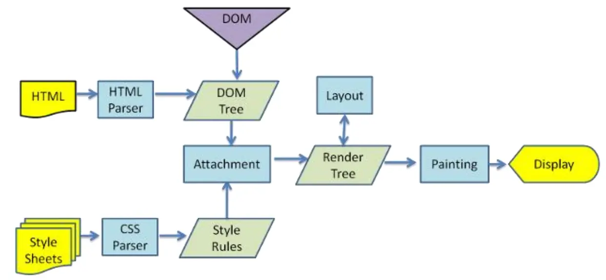

# 浏览器渲染原理

## 网页被解析过程

默认情况下服务器会给浏览器返回 index.html 文件，所以解析 HTML 是所有步骤的开始

第一步：解析 HTML，会构建`DOM Tree`

在解析过程中，如果遇到 CSS 的 link 元素，那么会由浏览器负责下载对应 CSS 文件

:::warning 注意

下载 CSS 文件不影响 DOM 解析

:::

第二步：浏览器下载完 CSS 文件后，会对 CSS 文件进行解析，解析出对应的规则树，可以称之为 `CSSOM Tree（CSS Object Model）`

第三步：当有了 DOM Tree 和 CSSOM Tree，就可以两个结合来构建 `Render Tree`

:::warning 注意

1. link 元素不会阻塞 DOM Tree 的构建过程，但是会阻塞 Render Tree 的构建过程。这是因为 Render Tree 在构建时，需要对应的 CSSOM Tree；

2. Render Tree 和 DOM Tree 并不是一一对应的关系，比如对于 display 为 none 的元素，压根不会出现在 render tree 中

:::

第四步：是在渲染树（Render Tree）上运行布局（`Layout`）以计算每个节点的几何体

- 渲染树会表示显示哪些节点以及其他样式，但是不表示每个节点的尺寸、位置等信息；
- `布局是确定呈现树中所有节点的宽度、高度和位置信息`

第五步：是将每个节点绘制（`paint`）到屏幕上

- 在绘制阶段，浏览器将布局阶段计算的每个 frame 转为屏幕上实际的像素点；
- 包括将元素的可见部分进行绘制，比如文本、颜色、边框、阴影、替换元素（比如 img）

## 回流和重绘

### 回流（重排）

- 第一次确定节点的大小和位置，称为布局（layout）
- `之后对节点大小、位置修改重新计算称之为回流`

什么情况下引起回流呢？

- 比如 DOM 结构发生改变（添加新的节点或者移除节点）
- 比如改变了布局（修改了 width、height、padding、font-size 等值）
- 比如窗口 resize（修改了窗口的尺寸等）
- 比如调用 getComputedStyle 方法获取尺寸、位置信息；

### 重绘

- 第一次渲染内容称之为绘制
- `之后重新渲染称之为重绘`

什么情况下会引起重绘呢？

- 比如修改背景色、文字颜色、边框颜色、样式等

:::warning 注意

回流一定会引起重绘，所以回流是一件很消耗性能的事情

:::

开发中要尽量避免发生回流

1. 修改样式时尽量`一次性修改`
2. 尽量`避免频繁的操作 dom`
3. 尽量避免通过 getComputedStyle 获取尺寸、位置等信息
4. 对某些元素使用 position 的 absolute 或者 fixed。（并不是不会引起回流，而是开销相对较小，不会对其他元素造成影响）

## 特殊解析-composite 合成

- 绘制的过程，可以将布局后的元素绘制到`多个合成图层`中。这是浏览器的一种优化手段；
- 默认情况下，标准流的内容都是被绘制在同一个图层（layer）中的；
- 而一些特殊的属性，会创建一个新的合成层，并且新的图层可以利用 GPU 来加速绘制。**因为每个合成层都是单独渲染的**
- 那么哪些属性可以形成新的合成层呢？常见的一些属性
  - 3D transforms
  - video、canvas、iframe
  - opacity 动画转换时
  - position：fixed
  - will-change: 一个实验性属性，提前告诉浏览器元素可能发生哪些变化
  - animation 或 transition 设置了 opacity 、transform
- 分层确实可以提高性能，但是它以`内存管理为代价`，因此不应作为 web 性能优化策略的一部分过度使用

## script 元素和页面解析的关系

- 浏览器在解析 HTML 的过程中，遇到了 script 元素是`不能继续构建` DOM 树的
- 它会停止继续构建，`首先下载 Javascript 代码`，并且`执行` JavaScript 脚本
- 只有等到 JavaScript 脚本`执行结束`后，才会继续解析 HTML，构建 DOM 树

为什么要这样做呢？

- 因为 JavaScript 作用之一就是操作 DOM，并且可以修改 DOM
- 如果我们等到 DOM 树构建完成并且渲染再执行 JavaScript，会造成`严重的回流和重绘`，影响页面的性能
- 所以会在遇到 script 元素时，优先下载和执行 JavaScript 代码，再继续构建 DOM 树

但是这个也往往会带来新的问题，特别是现代页面开发中

- 在目前的开发模式中（比如 Vue、React），脚本往往比 HTML 页面更“重”，处理时间需要更长；

- 所以会造成页面的`解析阻塞`，在脚本下载、执行完成之前，用户在界面上什么都看不到；

为了解决这个问题，script 元素给我们提供了两个属性（attribute）：defer 和 async。

## defer 属性

- defer 属性告诉浏览器**不要等待脚本下载**，而继续解析 HTML，构建 DOM Tree

  - 脚本会由浏览器来进行下载，但是不会阻塞 DOM Tree 的构建过程
  - 如果脚本提前下载好了，它会等待 DOM Tree 构建完成，在 `DOMContentLoaded` 事件**之前**先执行 defer 中的代码；

- 所以 `DOMContentLoaded` 总是会等待 defer 中的代码先执行完
- 另外多个带 defer 的脚本是可以保持**正确的顺序**执行的
- 从某种角度来说，defer 可以提高页面的性能，并且推荐放到 head 元素中

:::warning 注意

defer 仅适用于外部脚本，对于 script 默认内容会被忽略。

:::

## async 属性

- async 特性与 defer 有些类似，它也能够让脚本不阻塞页面。
- async 是让一个脚本`完全独立的`

  - 浏览器不会因 async 脚本而阻塞（与 defer 类似）
  - async 脚本不能保证顺序，它是独立下载、独立运行，不会等待其他脚本；
  - async 不能保证在 DOMContentLoaded 之前或者之后执行

- defer 通常用于需要在文档解析后操作 DOM 的 JavaScript 代码，并且对多个 script 文件有顺序要求的；
- async 通常用于独立的脚本，对其他脚本，甚至 DOM 没有依赖的；
