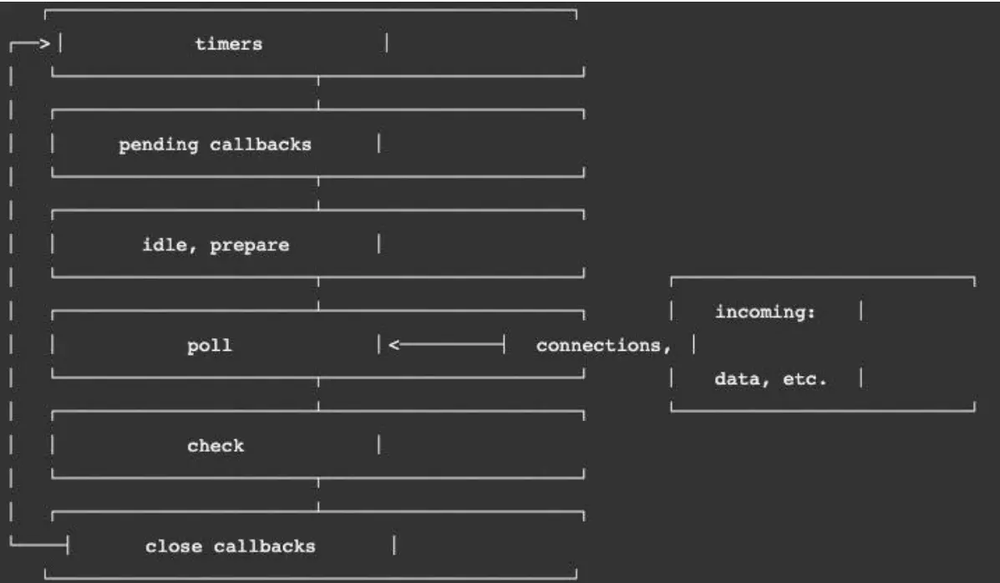

# 事件循环

## 浏览器事件循环

- 宏任务队列（`macrotask queue`）：ajax、setTimeout、setInterval、DOM 监听、UI Rendering 等
- 微任务队列（`microtask queue`）：Promise 的 then 回调、 Mutation Observer API、queueMicrotask()等

1. `main script` 中的代码优先执行（编写的顶层 script 代码）
2. 在执行任何`一个`宏任务之前（不是队列，是一个宏任务），都会先查看`微任务队列`中是否有任务需要执行
   - 也就是宏任务执行之前，必须保证微任务队列是空的；
   - 如果不为空，那么就优先执行微任务队列中的任务（回调）

## Node 事件循环

- 宏任务（`macrotask`）：setTimeout、setInterval、IO 事件、setImmediate、close 事件；
- 微任务（`microtask`）：Promise 的 then 回调、process.nextTick、queueMicrotask；

但是，Node 中的事件循环不只是 微任务队列和 宏任务队列：

- 微任务队列：

  `next tick queue`：process.nextTick；

  `other queue`：Promise 的 then 回调、queueMicrotask；

- 宏任务队列：

  `timer queue`：setTimeout、setInterval；

  `poll queue`：IO 事件；

  `check queue`：setImmediate；

  `close queue`：close 事件；

在每一次事件循环的 tick 中，会按照如下顺序来执行代码

1. next tick microtask queue；
2. other microtask queue；
3. timer queue；
4. poll queue；
5. check queue；
6. close queue；

### 阶段图解

- 定时器（`Timers`）：本阶段执行已经被 setTimeout() 和 setInterval() 的调度回调函数。
- 待定回调（`Pending Callback`）：对某些系统操作（如 TCP 错误类型）执行回调，比如 TCP 连接时接收到 ECONNREFUSED。
- `idle, prepare`：仅系统内部使用。
- 轮询（`Poll`）：检索新的 I/O 事件；执行与 I/O 相关的回调；
- 检测（`check`）：setImmediate() 回调函数在这里执行。
- 关闭的回调函数：一些关闭的回调函数，如：socket.on('close', ...)。
