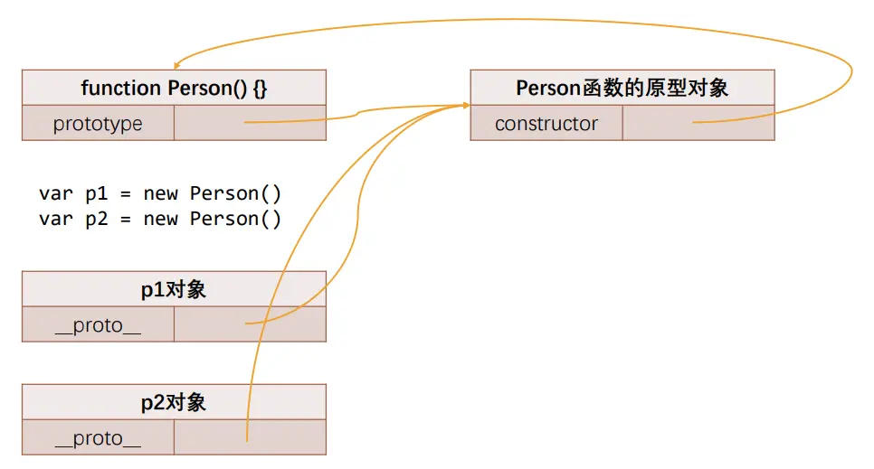
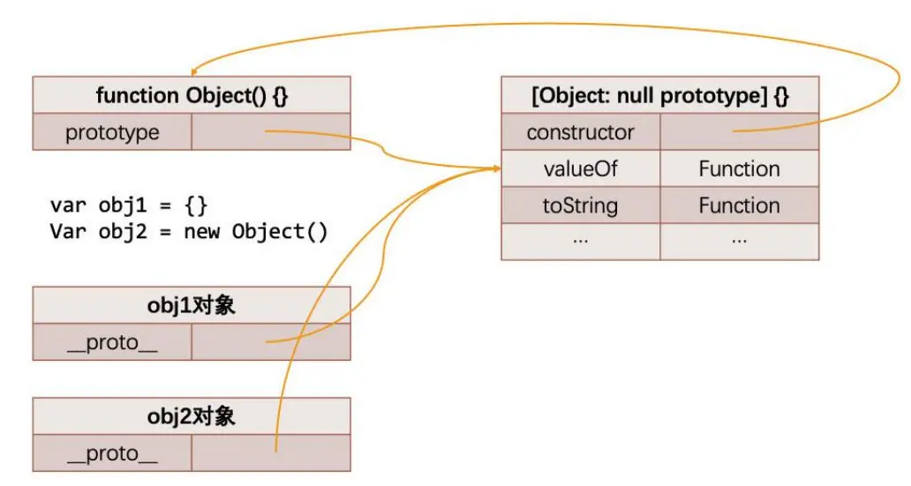

# 原型链与继承

JavaScript 当中每个对象都有一个特殊的内置属性 `[[prototype]]`，这个特殊的对象可以指向另外一个对象

获取的方式有两种：

- 方式一：通过对象的 `__proto__` 属性可以获取到（但是这个是早期浏览器自己添加的，存在一定的兼容性问题）；
- 方式二：通过 `Object.getPrototypeOf` 方法可以获取到；

所有的函数都有一个 `prototype` 的属性（注意：不是`__proto__`）

## 再看 new 操作符

回顾一下 `new` 的步骤：

1. 在堆内存中创建一个空对象
2. 将空对象的`[[prototype]]` 属性值设置为构造函数的 `prototype` 对象引用
3. 将 `this` 绑定该空对象
4. 若是没有指定返回对象，则返回新对象

```js
function Person() {}
const p1 = new Person()
const p2 = new Person()
// p1.__proto__ === p2.__proto__ === Person.prototype
```

对应内存图



## constructor

原型（`prototype`）对象上默认有一个 `constructor` 属性，指向当前的函数对象

```js{2}
function Person() {}
console.log(Person.prototype.constructor === Person) // true
```

## 原型链

从一个对象上获取属性，如果在当前对象中没有获取到，则会去它的原型上获取，或者原型的原型，以此类推，这就是原型链

原型链最顶层的原型对象就是 Object 的原型对象


## ES5 实现继承

```js
function object(o) {
  function F() {}
  F.prototype = o
  return new F()
}

function inheritPrototype(subType, superType) {
  subType.prototype = object(superType.prototype)
  subType.prototype.constructor = subType
}

function Person() {}
function Student() {}
inheritPrototype(Student, Person)
```

## ES6 实现继承

class 类

每个类只能有一个 `constructor` 函数

类中定义的方法，则被放在该类的原型上。意味着通过类创建的实例可以共享这些方法，而不是每个实例都创建一份新的方法副本。

```js
class Person {
  constructor(name) {
    this.name = name
  }
  greet() {
    console.log(`Hello, my name is ${this.name}`)
  }
}

const person1 = new Person('Alice')
const person2 = new Person('Bob')

person1.greet() // 输出: Hello, my name is Alice
person2.greet() // 输出: Hello, my name is Bob

console.log(person1.greet === person2.greet) // 输出: true
```

类的访问器

```js
class Person {
  constructor(name) {
    this._name = name // 使用下划线表示私有属性的惯例
  }
  // 定义 getter 方法
  get name() {
    return this._name
  }
  // 定义 setter 方法
  set name(newName) {
    if (newName) {
      this._name = newName
    } else {
      console.error('Name cannot be empty')
    }
  }
}

const person = new Person('Alice')
console.log(person.name) // 输出: Alice

person.name = 'Bob'
console.log(person.name) // 输出: Bob

person.name = '' // 输出: Name cannot be empty
console.log(person.name) // 输出: Bob
```

类的静态方法

```js
class MathUtils {
  // 定义静态方法
  static add(a, b) {
    return a + b
  }

  static subtract(a, b) {
    return a - b
  }
}

// 调用静态方法
console.log(MathUtils.add(5, 3)) // 输出: 8
console.log(MathUtils.subtract(5, 3)) // 输出: 2

// 尝试通过实例调用静态方法会导致错误
const mathUtils = new MathUtils()
console.log(mathUtils.add(5, 3)) // TypeError: mathUtils.add is not a function
```

### extends 和 super

`extends` 关键字可以方便的帮我们实现继承

`super` 关键字
:::warning 注意

在子（派生）类的构造函数中使用 this 或者返回默认对象之前，必须先通过 super 调用父类的构造函数！

:::

super 的使用位置有三个：子类的构造函数、实例方法、静态方法；

```js
class Animal {
  constructor(name) {
    this.name = name
  }
  speak() {
    console.log(`${this.name} makes a noise.`)
  }
}

class Dog extends Animal {
  constructor(name, breed) {
    super(name) // 调用父类的构造函数
    this.breed = breed
  }
  speak() {
    super.speak() // 调用父类的方法
    console.log(`${this.name} barks.`)
  }
}

const dog = new Dog('Rex', 'German Shepherd')
dog.speak()
// 输出:
// Rex makes a noise.
// Rex barks.
```

### 多重继承

JavaScript 本身不支持多重继承，但可以通过组合多个类的方式来实现类似的效果。常见的方法是使用 `mixin`（混入）模式。以下是一个示例，展示了如何使用 mixin 来实现多重继承：

```js
// 定义一个混入函数，用于将多个类的功能混入到目标类中
function mixin(target, ...sources) {
  Object.assign(target.prototype, ...sources.map((source) => source.prototype))
}

// 定义两个独立的类
class CanFly {
  fly() {
    console.log(`${this.name} can fly.`)
  }
}

class CanSwim {
  swim() {
    console.log(`${this.name} can swim.`)
  }
}

// 定义一个新的类，将两个类的功能混入其中
class Animal {
  constructor(name) {
    this.name = name
  }
}

class Duck extends Animal {}
mixin(Duck, CanFly, CanSwim)

const duck = new Duck('Donald')
duck.fly() // 输出: Donald can fly.
duck.swim() // 输出: Donald can swim.
```
