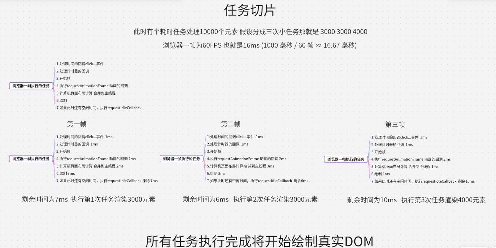
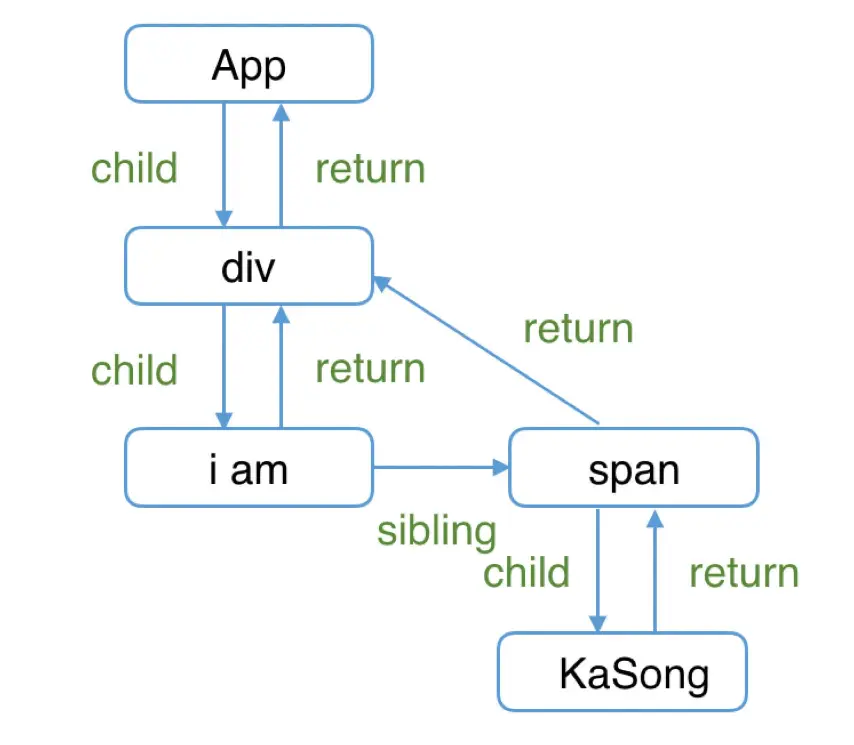

# React Fiber

`Fiber` 是 React 16 引入的一种新的协调引擎，用于解决和优化 React 应对`复杂 UI 渲染`时的`性能问题`

React 源码解析英文版  [https://pomb.us/build-your-own-react/](https://pomb.us/build-your-own-react/)

## Fiber 的作用

为了解决 `React15` 在`大组件更新`时产生的卡顿现象，React 团队提出了 `Fiber` 架构，并在 `React16` 发布，将 `同步递归无法中断的更新` 重构为 `异步的可中断更新`

它实现了 4 个具体目标

1. `可中断的渲染`：Fiber 允许将大的渲染任务拆分成多个`小的工作单元`（Unit of Work），使得 React 可以在`空闲时间`执行这些小任务。当浏览器需要处理`更高优先级`的任务时（如用户输入、动画），可以`暂停渲染`，先处理这些任务，然后再`恢复`未完成的渲染工作。

2. `优先级调度`：在 Fiber 架构下，React 可以根据`不同任务的优先级`决定何时更新哪些部分。React 会优先更新`用户可感知的部分`（如动画、用户输入），而低优先级的任务（如数据加载后的界面更新）可以延后执行。

3. `双缓存树`：Fiber 架构中有两棵 Fiber 树——`current fiber tree`（当前正在渲染的 Fiber 树）和 `work in progress fiber tree`（正在处理的 Fiber 树）。React 使用这两棵树来`保存更新前后的状态`，从而更高效地进行`比较和更新`。

4. `任务切片`：在浏览器的空闲时间内（利用 `requestIdleCallback` 思想），React 可以将渲染任务拆分成多个`小片段`，逐步完成 Fiber 树的构建，避免一次性完成所有渲染任务导致的阻塞。

:::warning React 只是借鉴 requestIdleCallback 思想，实际并不是依靠 requestIdleCallback 函数实现
:::

### 双缓存树

`react` 内部有两颗树维护着两个状态：一个是`fiber tree`，一个是`work in progress fiber tree`

`fiber tree`: 表示当前`正在渲染`的 fiber 树
`work in progress fiber tree`: 表示更新过程中`新生成`的 fiber 树，也就是渲染的下一次 UI 状态

举个例子:

当我们用 canvas 绘制动画时，每一帧绘制前都会调用 ctx.clearRect 清除上一帧的画面，如果当前帧画面计算量比较大，导致清除上一帧画面到绘制当前帧画面之间有较长间隙，就会出现白屏。

为了解决这个问题，我们可以在内存中绘制当前帧动画，绘制完毕后直接用当前帧替换上一帧画面，由于省去了两帧替换间的计算时间，不会出现从白屏到出现画面的闪烁情况。

### 任务切片

要先理解切片得先理解浏览器一帧做些什么

1. 处理事件的回调 click...事件
2. 处理计时器的回调
3. 开始帧
4. 执行 `requestAnimationFrame` 动画的回调
5. 计算机页面布局计算 合并到主线程
6. 绘制
7. 如果此时还有空闲时间，执行 `requestIdleCallback`

例如要更新 10000 条 dom 数据

我们可以分成三个小任务进行更新，并且把每一段任务插入`requestIdleCallback` 如图



## Fiber 应用

先利用 `requestIdleCallback` 建立起循环

```js
// 下一个工作单元
let nextUnitOfWork = null
// requestIdleCallback 传入 deadline
function workLoop(deadline) {
  let shouldYield = false
  while (nextUnitOfWork && !shouldYield) {
    // 在有下一个工作单元 且 有剩余时间的时候执行
    // performUnitOfWork在下文实现，该函数接受当前工作单元，并返回下一个工作单元
    nextUnitOfWork = performUnitOfWork(
      nextUnitOfWork
    )
    shouldYield = deadline.timeRemaining() < 1
  }
  // 在下一帧中继续回调
  requestIdleCallback(workLoop)
}
​
requestIdleCallback(workLoop)
```

接下来实现 `performUnitOfWork`，例如有一个这样的结构

```js
React.render(
  <div>
    <h1>
      <p />
      <a />
    </h1>
  </div>,
  doucument.querySelector('#root')
)
```

在 `React.render` 中，我们将创建 `root fiber` 并将其设置为 `nextUnitOfWork` 。其余的工作将在 `performUnitOfWork` 函数中完成

performUnitOfWork 函数为每个 fiber 做三件事

1. 将元素添加到 DOM
2. 创建该元素的子元素的 fiber
3. 选择下一个工作单元

### 那么该如何选择下一个工作单元呢？



该图可以看到 `fiber` 对象结构，每个 fiber 只有一个 child 节点，而其它与 child 节点同级的都成为 sibling 节点

如果当前 fiber 有一个 child，那么这个 child 会成为下一个工作单元<br>
在上图中，当完成对 div 的 fiber 工作后，下一个工作单元将是 h1

如果当前 fiber 没有 child，那就使用 sibling 作为下一个工作单元<br>
在上图中，当完成对 p 的 fiber 工作后，下一个工作单元将是 a

如果当前 fiber 即没有 child，也没有 sibling，那就把 "叔叔" （ `the sibling of the parent`） 作为下一个工作单元
在上图中，当完成对 a 的 fiber 工作后，下一个工作单元将是 h2
