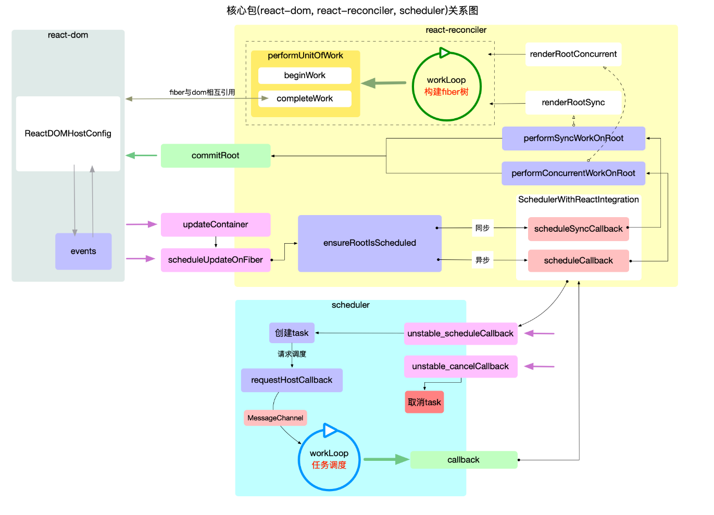

# React 流程

观看文档： https://7km.top/main/bootstrap

## 时间切片原理

消费任务队列的过程中, 可以消费`1~n`个 task, 甚至清空整个 queue. 但是在每一次具体执行`task.callback`之前都要进行超时检测, 如果超时可以立即退出循环并等待下一次调用.

如何判断超时：当前时间-任务开始时间 > 时间切片（5ms）

## 可中断渲染原理

在时间切片的基础之上, 如果单个任务的回调函数(`task.callback`)执行时间就很长(假设 200ms). 就需要`task.callback`自己能够检测是否超时, 所以在 fiber 树构造过程中, 每构造完成一个单元, 都会检测一次超时, 如遇超时就退出`fiber树构造循环`, 返回一个新的回调函数注册一个任务，等待下一次回调继续未完成的`fiber树构造`.

## beginWork

1. 根据  `ReactElement`对象创建`fiber`节点，调用`reconcileChildren`生成 Fiber 子节点，在`reconcileChildren`函数中实现了 diff 算法，决定哪些节点可复用
2. 设置`fiber.flags`(二进制形式变量, 用来标记  `fiber`节点 的`增,删,改`状态, 等待`completeWork阶段处理`)

## completeWork

1. 给`fiber`节点创建 DOM 实例,为 DOM 节点设置属性
2. 识别`beginWork`阶段设置的`fiber.flags`, 判断当前  `fiber`  是否有副作用(增,删,改), 如果有, 需要将当前  `fiber`  加入到父节点的`effects`队列, 等待`commit`阶段处理.

## commitRoot

整个渲染逻辑都在 commitRoot
分三个阶段

1. **Before Mutation Phase（突变前阶段）**
   dom 变更之前, 处理副作用队列中带有`Snapshot`,`Passive`标记的`fiber`节点。
   - **Snapshot**：表示需要调用 `getSnapshotBeforeUpdate`,以获取 DOM 变更前的快照数据。
   - **Passive**：表示需要调用 `useEffect` 的 cleanup 函数，清理上一次渲染的副作用。
2. Mutation Phase（突变阶段）
   dom 变更, 界面得到更新. 处理副作用队列中带有`Placement`, `Update`, `Deletion`标记的`fiber`节点，创建、更新、或删除 DOM 元素
3. Layout Phase（布局阶段）
   确保在 DOM 更新完成后执行所有需要依赖于最新布局的副作用和回调

## 其它知识

### 为什么不用 generator 做调度器

[官方解释](https://github.com/facebook/react/issues/7942#issuecomment-254987818)

1. 使用 generator 必须将每个函数都包裹在生成器中。这不仅增加了大量的语法开销，而且增加了运行时开销
2. generators are stateful. You can't resume in the middle of it.

三个昂贵工作 ABC 被分配在不同时间切片中执行且有上下文依赖

假设有这么一种情况，执行完了 A、B，但还没执行 C，但 B 此时有一个更新，那么我没法重用 A 执行的结果，也就是 A 执行完毕后的结果并没有被缓存到

官方解释：React 没法在这里去注入缓存，如果用全局缓存的话，最终也会遇到缓存失效的问题

### 为什么要用 MessageChannel 做时间切片

首先必须得是一个宏任务

在实际执行中，首次执行同步代码会作为一次宏任务，因此后续的顺序可以看作：

`执行微任务队列 => 执行 RAF 回调(若要执行渲染) => 渲染(若要执行渲染) => 下一个任务`

Scheduler 需要满足以下功能点：

1. 将主线程还给浏览器，让浏览器有机会更新页面
2. 在未来某个时刻继续调度任务，执行上次还没有完成的任务

也就是说我们需要一个宏任务，因为宏任务在渲染后的下一帧，不会阻塞本次循环.

使用 MessageChannel 的目的就是为了产生宏任务

- 为什么不使用 setTimeout(fn, 0) 呢？

递归的 setTimeout() 调用会使调用间隔变为 4ms，导致浪费了 4ms。

- 为什么不使用 rAF() 呢？

如果上次任务调度不是 rAF() 触发的，将导致在当前帧更新前进行两次任务调度。
页面更新的时间不确定，如果浏览器间隔了 10ms 才更新页面，那么这 10ms 就浪费了。
