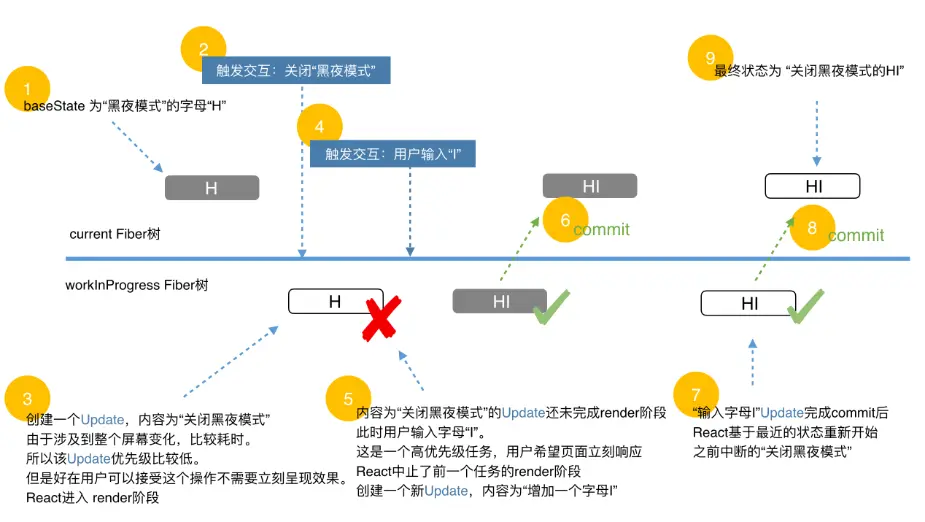

# React 优先级

观看文档： https://7km.top/main/priority#%E4%BC%98%E5%85%88%E7%BA%A7%E4%BD%BF%E7%94%A8

## 什么是优先级

`状态更新`由`用户交互`产生，用户心里对`交互执行顺序`有个预期。`React` 根据`人机交互研究的结果`中用户对交互的预期顺序为交互产生的状态更新赋予不同优先级。

具体如下：

- 生命周期方法：同步执行。

- 受控的用户输入：比如输入框内输入文字，同步执行。

- 交互事件：比如动画，高优先级执行。

- 其他：比如数据请求，低优先级执行。

## 如何调度优先级

`React` 通过 `Scheduler` 调度任务。

具体到代码，每当需要调度任务时，`React` 会调用 `Scheduler` 提供的方法 `runWithPriority`。

该方法接收一个`优先级常量`与一个`回调函数作`为参数。回调函数会以`优先级高低`为顺序排列在一个`定时器`中并在合适的时间触发。

对于更新来讲，传递的回调函数一般为[状态更新流程概览](./update.md#流程概览)一节讲到的 `render` 阶段的入口函数。

> 你可以在 [unstable_runWithPriority](https://github.com/facebook/react/blob/970fa122d8188bafa600e9b5214833487fbf1092/packages/scheduler/src/Scheduler.js#L217) 这里看到 runWithPriority 方法的定义。在[这里](https://github.com/facebook/react/blob/970fa122d8188bafa600e9b5214833487fbf1092/packages/scheduler/src/SchedulerPriorities.js)看到 Scheduler 对优先级常量的定义。

## 例子

优先级最终会反映到 `update.lane` 变量上。当前我们只需要知道这个变量能够区分 `Update` 的优先级。

接下来我们通过一个例子结合上一节介绍的 `Update` 相关字段讲解优先级如何决定更新的顺序。



在这个例子中，有两个 `Update`。我们将“关闭黑夜模式”产生的 `Update` 称为 `u1`，输入字母“I”产生的 `Update` 称为 `u2`。

其中 `u1` 先触发并进入 `render` 阶段。其优先级较低，执行时间较长。此时：

```js
fiber.updateQueue = {
  baseState: {
    blackTheme: true,
    text: 'H'
  },
  firstBaseUpdate: null,
  lastBaseUpdate: null
  shared: {
    pending: u1
  },
  effects: null
};
```

在 `u1` 完成 `render` 阶段前用户通过键盘输入字母 “I”，产生了 `u2`. `u2` 属于受控的用户输入，优先级高于 `u1`，于是中断 `u1` 产生的 `render` 阶段。

此时：

```js
fiber.updateQueue.shared.pending === u2 ----> u1
                                     ^        |
                                     |________|
// 即
u2.next === u1;
u1.next === u2;
```

其中`u2`优先级高于 `u1`。

接下来进入`u2`产生的`render`阶段。

遍历 `baseUpdate`，处理优先级合适的`Update`（这一次处理的是更高优的 `u2`）。

由于 `u2` 不是 `baseUpdate` 中的第一个 `update`，在其之前的 `u1` 由于优先级不够被跳过。

`update` 之间可能有依赖关系，所以被跳过的 `update` 及其后面所有 `update` 会成为下次更新的 `baseUpdate`。（即 u1 --> u2）

最终`u2` 完成 `render - commit` 阶段

此时：

```js
fiber.updateQueue = {
  baseState: {
    blackTheme: true,
    text: 'HI'
  },
  firstBaseUpdate: u1,
  lastBaseUpdate: u2
  shared: {
    pending: null
  },
  effects: null
};
```

在 `commit` 阶段结尾会再调度一次更新。在该次更新中会基于 `baseState` 中 `firstBaseUpdate` 保存的 `u1`，开启一次新的 `render` 阶段。

最终两次 `Update` 都完成后的结果如下：

```js
fiber.updateQueue = {
  baseState: {
    blackTheme: true,
    text: 'HI'
  },
  firstBaseUpdate: null,
  lastBaseUpdate: null
  shared: {
    pending: null
  },
  effects: null
};
```

我们可以看见，`u2`对应的更新执行了两次，相应的 `render` 阶段的生命周期勾子 `componentWillXXX` 也会触发两次。这也是为什么这些勾子会被标记为`unsafe_`。

## 如何保证状态正确

现在我们基本掌握了 `updateQueue` 的工作流程。还有两个疑问：

- `render` 阶段可能被中断。如何保证 `updateQueue` 中保存的 `Update` 不丢失？

- 有时候当前状态需要`依赖前一个状态`。如何在支持跳过低优先级状态的同时保证`状态依赖的连续性`？

### 如何保证 Update 不丢失

在 `render` 阶段，`shared.pending` 的环被剪开并连接在 `updateQueue.lastBaseUpdate` 后面。

实际上 `shared.pending` 会被同时连接在 `workInProgress updateQueue.lastBaseUpdate` 与 `current updateQueue.lastBaseUpdate` 后面

当 `render` 阶段被中断后重新开始时，会基于 `current updateQueue`克隆出` workInProgress updateQueue`。由于 `current updateQueue.lastBaseUpdate` 已经保存了上一次的 `Update`，所以不会丢失。

当 `commit` 阶段完成渲染，由于 `workInProgress updateQueue.lastBaseUpdate` 中保存了上一次的 `Update`，所以 `workInProgress Fiber` 树变成 `current Fiber` 树后也不会造成 `Update` 丢失。

### 如何保证状态依赖的连续性

当某个 `Update` 由于优先级低而被跳过时，保存在 `baseUpdate` 中的不仅是该 `Update`，还包括链表中该 `Update` 之后的所有 `Update`。

考虑如下例子：

```js
baseState: ''
shared.pending: A1 --> B2 --> C1 --> D2
```

其中字母代表该 `Update` 要在页面插入的字母，数字代表优先级，值越低优先级越高。

第一次 render，优先级为 1。

```js
baseState: ''
baseUpdate: null
render阶段使用的Update: [A1, C1]
memoizedState: 'AC'
```

其中 B2 由于优先级为 2，低于当前优先级，所以他及其后面的所有 `Update` 会被保存在 `baseUpdate` 中作为下次更新的 Update（即 B2 C1 D2）。

这么做是为了保持状态的前后依赖顺序。

第二次 render，优先级为 2。

```js
baseState: 'A'
baseUpdate: B2-- > C1-- > D2
render阶段使用的Update: [B2, C1, D2]
memoizedState: 'ABCD'
```

注意这里 `baseState` 并不是上一次更新的 `memoizedState`。这是由于 B2 被跳过了。

即当有 `Update` 被跳过时，下次更新的` baseState !== 上次更新的 memoizedState`

通过以上例子我们可以发现，React 保证最终的状态一定和用户触发的交互一致，但是中间过程状态可能由于设备不同而不同。
