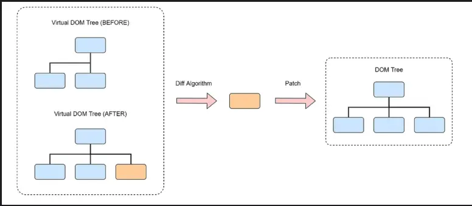

# 虚拟 DOM

`Virtual Dom` 就是用 Javascript 对象去描述一个 DOM 结构，虚拟 DOM 不是直接操作浏览器的真实 DOM，而是首先对 UI 的更新在虚拟 DOM 中进行，再将变更高效地同步到真实 DOM 中

## 优点

1. `性能优化`：直接操作真实 DOM 是比较昂贵的，尤其是当涉及到大量节点更新时。虚拟 DOM 通过减少不必要的 DOM 操作，主要体现在`diff`算法的复用操作，其实也提升不了多少性能。
2. `跨平台性`：虚拟 DOM 是一个与平台无关的概念，它可以映射到不同的渲染目标，比如浏览器的 DOM 或者移动端`(React Native)`的原生 UI。



## React.createElement

用于生成虚拟 DOM 树，返回一个包含 type（元素类型）和 props（属性和子元素）的对象。 children 可以是`文本`或其他虚拟 DOM 对象。

`React.createTextElement`: 用于处理`文本节点`，将字符串封装成虚拟 DOM 对象。

```js
const React = {
  createElement(type, props = {}, ...children) {
    return {
      type,
      props: {
        ...props,
        children: children.map(
          (child) =>
            typeof child === 'object'
              ? child // 如果子元素是对象（嵌套元素），返回对象
              : this.createTextElement(child) // 否则将字符串转换为文本元素
        ),
      },
    }
  },

  createTextElement(text) {
    // 文本是没有props children什么的 这样做只是为了结构统一方便遍历
    return {
      type: 'TEXT_ELEMENT',
      props: {
        nodeValue: text,
        children: [],
      },
    }
  },
}
```

## React.render

`React.render`将虚拟 DOM 转化为实际 DOM 元素。 使用`递归`的方式渲染所有子元素。 最后将生成的 DOM 节点插入到指定的容器中

```js

function render(element, container) {
  // 需要处理文本元素，如果元素类型是 TEXT_ELEMENT ，我们创建一个文本节点而不是常规节点。
  const dom =
    element.type == "TEXT_ELEMENT"
      ? document.createTextNode("")
      : document.createElement(element.type)

  // 将元素属性分配给节点
  Object.keys(element.props)
    .filter(key => key !== "children")
    .forEach(name => {
      dom[name] = element.props[name]
    })
​
  // 为每个子节点递归执行相同的操作
  element.props.children.forEach(child =>
    render(child, dom)
  )
​
  container.appendChild(dom)
}

```
