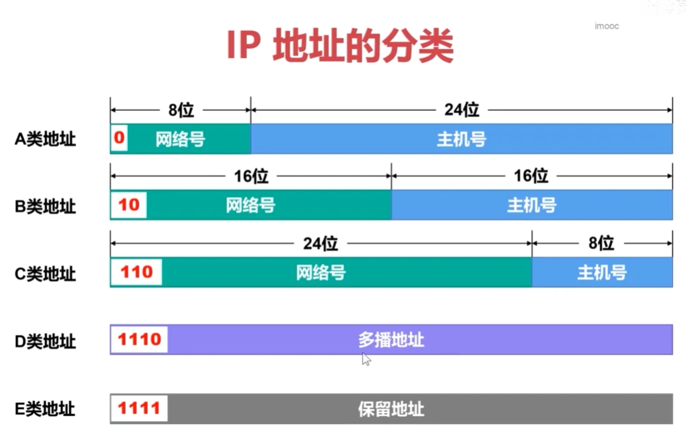
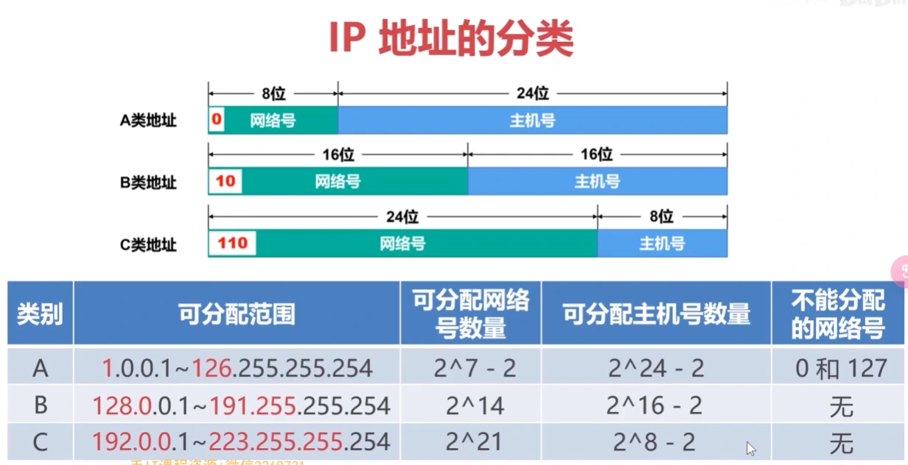
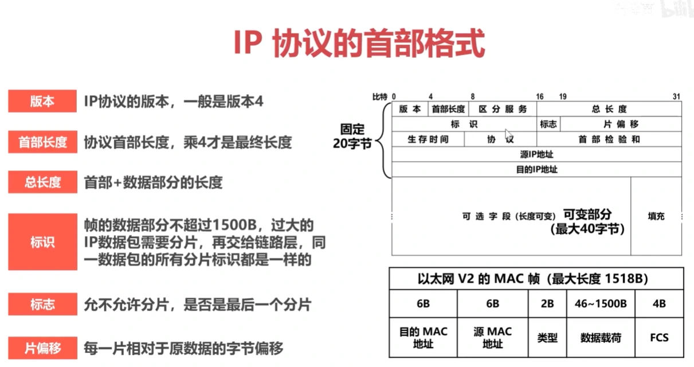
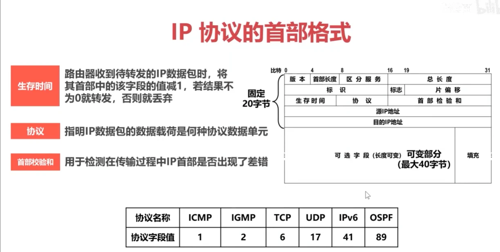
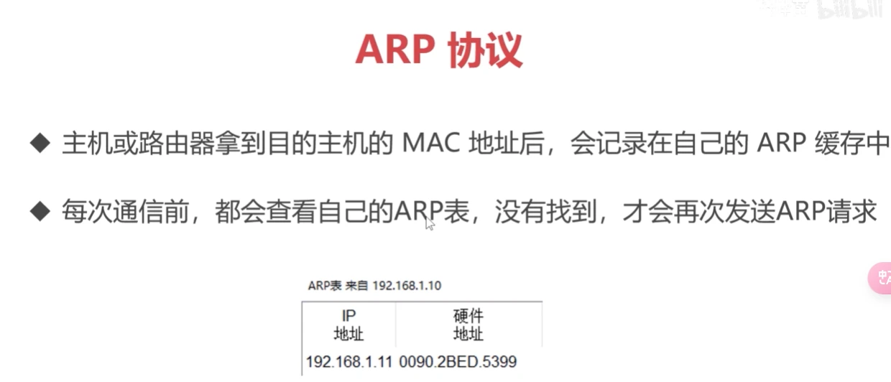
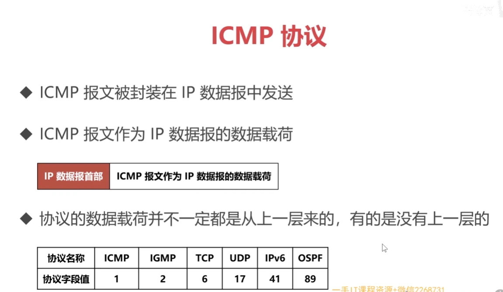
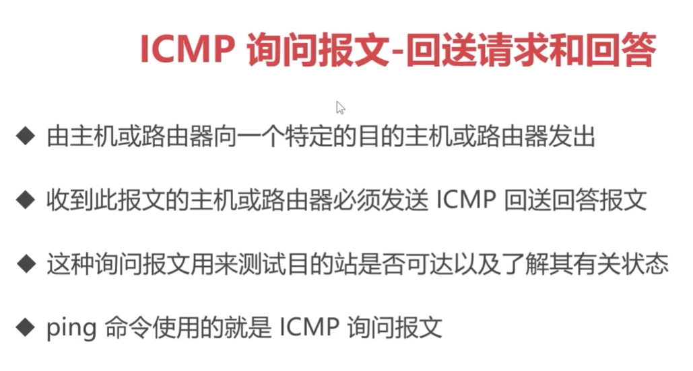
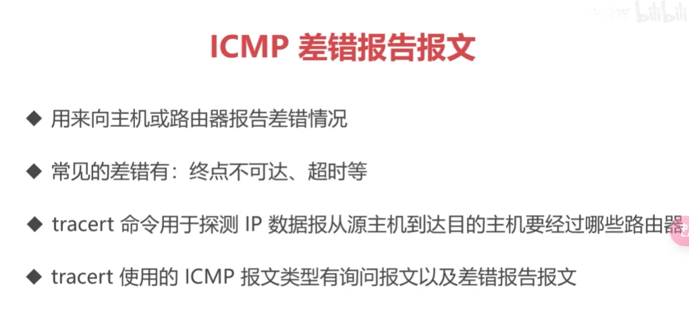

# 网络层

## IP 地址

IP 地址是给因特网上的每个主机或路由器的每个接口分配的一个标识符

IP 地址分类

- 只有 A、B、C 类地址可以分配给网络中的主机或路由器的各接口
- 主机号“全 0”的地址是网络地址，不参与分配
- 主机号“全 1”的地址是该网络的广播地址，不参与分配

## 子网和子网掩码

- 从主机号中借用一些比特位作为子网号来划分出不同的子网
- 可以使用子网掩码标识出子网的网络号和主机号分别由多少位
- 子网掩码：左起连续的 1 对应 IP 中的网络号和子网号，之后的 0 对应主机号

## 协议

### IP 协议

网际协议 **I**nternet **P**rotocol
TCP/IP 体系结构网际层中的核心协议

#### 首部格式

### ARP 协议

地址解析协议 **A**ddress **R**esolution **P**rotocol
通过 IP 地址获取 MAC 地址
同一网络中的主机或路由器接口之间才能使用 ARP 获取 MAC 地址

### ICMP 协议

网际控制报文协议 **I**nternet **C**ontrol **M**essage **P**rotocol
主机或路由器使用 ICMP 来发送询问报文或差错报告报文
常用的询问报文有两种：回送请求和回答、时间戳请求和回答

