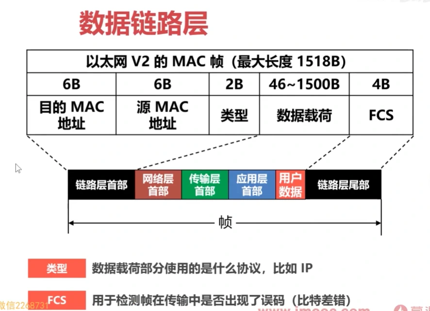
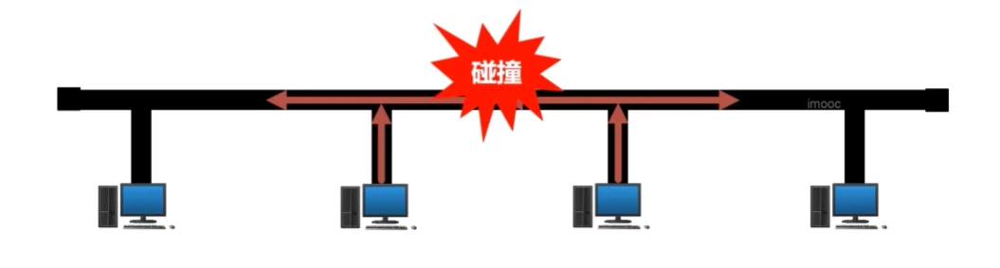
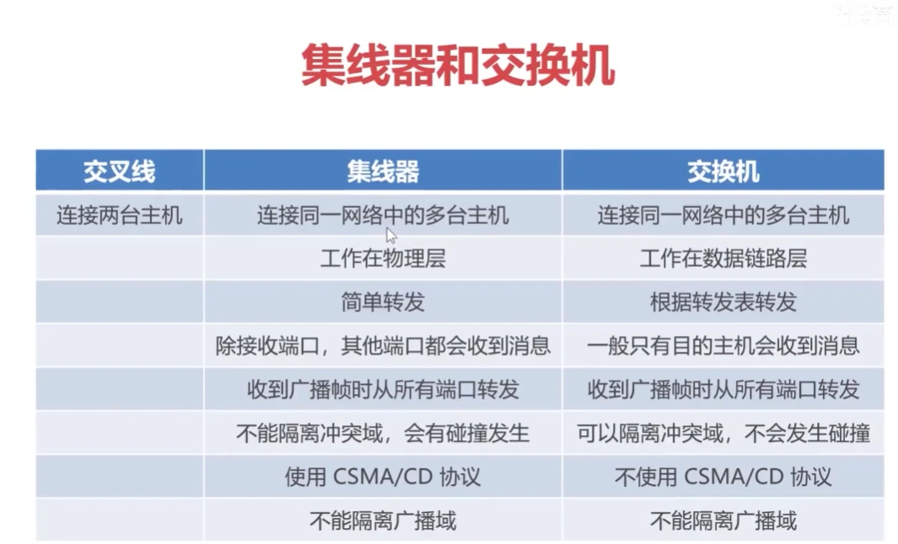

# 数据链路层

链路（Link）：从一个节点到相邻节点的一段物理线路（有线或无线），而中间没有任何其他的交换节点（主要指路由器）

数据链路层解决数据包在一个网络或一段链路上传输的问题，主要靠 MAC 地址

## 帧格式

## 协议

### CSMA/CD 协议

载波监听多址接入/碰撞检测
**C**arrier **S**ense **M**ultiple **A**ccess **C**ollision **D**etection
解决共享总线以太网上各站点争用总线的问题（**有限局域网**）

### CSMA/CA 协议

载波监听多址接入/碰撞避免
**C**arrier **S**ense **M**ultiple **A**ccess **C**ollision **A**voidance
无线局域网使用
与共享总线以太网使用有线的传输介质不同，无线局域网不能使用 CSMA/CD 协议

为什么无线局域网不能使用 CSMA/CD？
对硬件要求高，且检测可能不准确，不用深究

### PPP 协议

点对点协议
**P**oint-to-**P**oint **P**rotocol
两种应用

1. 主机和因特网服务提供商
2. 路由器之间

## 集线器和交换机

