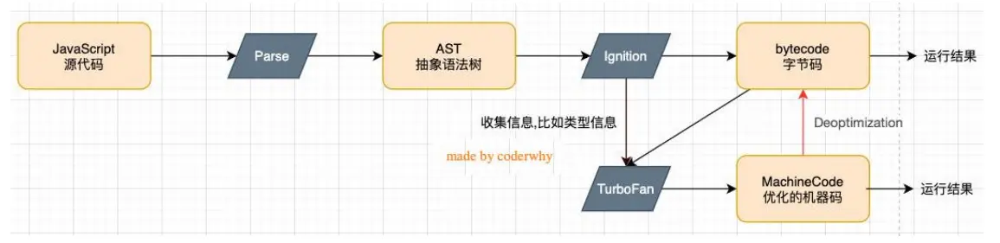
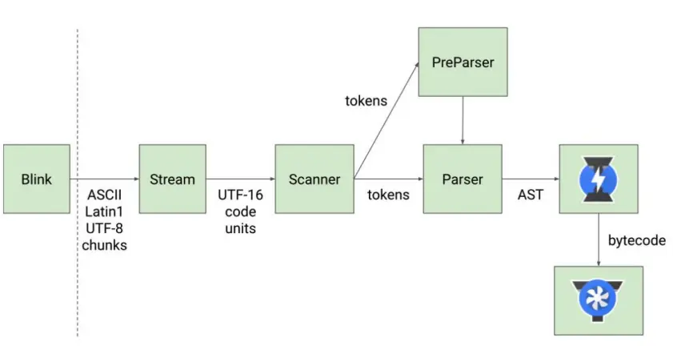
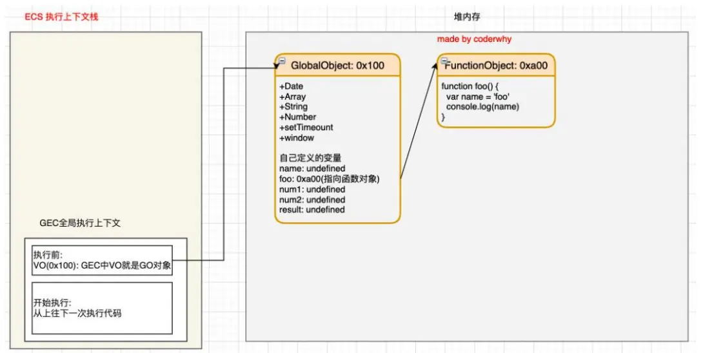
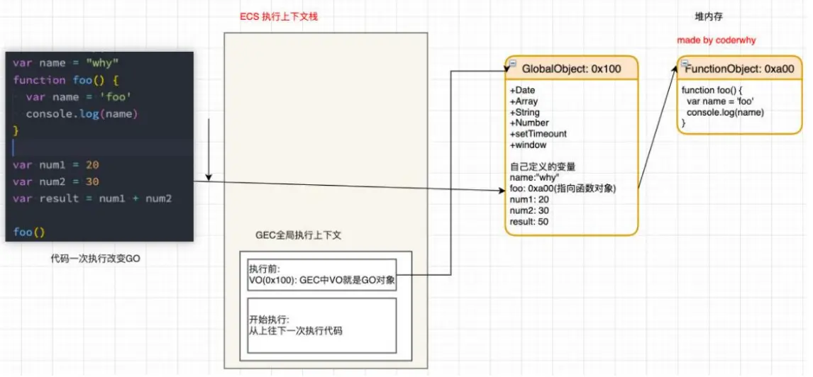
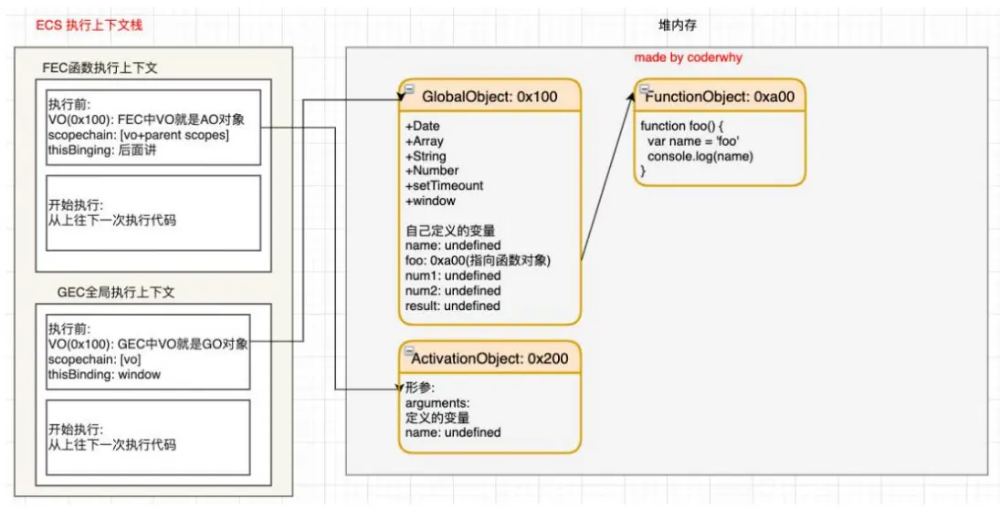

# JavaScript 运行原理

## 深入 V8 引擎原理

V8 是用 C ++编写的 Google 开源高性能 `JavaScript` 和 `WebAssembly` 引擎，它用于 Chrome 和 Node.js 等。

它实现 ECMAScript 和 WebAssembly，并在 Windows 7 或更高版本，macOS 10.12+和使用 x64，IA-32，ARM 或 MIPS 处理
器的 Linux 系统上运行。

V8 可以独立运行，也可以嵌入到任何 C ++应用程序中。



### V8 引擎架构

`Parse` 模块会将 JavaScript 代码转换成`AST（抽象语法树）`，这是因为解释器并不认识 JavaScript 代码；

- 如果函数没有被调用，那么是不会被转换成 AST 的；
- Parse 的 V8 官方文档：https://v8.dev/blog/scanner

`Ignition` 是一个解释器，会将 AST 转换成 `ByteCode（字节码）`

- 同时会`收集 TurboFan 优化所需要的信息`（比如函数参数的类型信息，有了类型才能进行真实的运算）；
- 如果函数`只调用一次`，Ignition 会解释执行 ByteCode；
- Ignition 的 V8 官方文档：https://v8.dev/blog/ignition-interpreter

`TurboFan` 是一个编译器，可以将字节码编译为 CPU 可以直接执行的机器码；

- 如果一个函数被`多次调用`，那么就会被标记为`热点函数`，那么就会经过 `TurboFan` 转换成优化的`机器码`，提高代码的执行性能；
- 但是，`机器码实际上也会被还原为 ByteCode`，这是因为如果后续执行函数的过程中，`类型发生了变化`（比如 sum 函数原来执行的是 number 类型，后来执行变成了 string 类型），之前优化的机器码并不能正确的处理运算，就会逆向的转换成字节码；
- TurboFan 的 V8 官方文档：https://v8.dev/blog/turbofan-jit

### V8 引擎解析图



- 词法分析（`lexical analysis`）

  - 将字符序列转换成 token 序列的过程
  - token 是记号化（`tokenization`）的缩写
  - 词法分析器（lexical analyzer），也叫扫描器（`scanner`）

- 语法分析（`systactic analysis`，也叫 parsing）
  - 语法分析器也叫 `parser``

## JavaScript 执行过程

1. 全局对象

- js 引擎会在执行代码之前，在堆内存中创建一个全局对象：`Global Object（GO）`
  - 该对象 所有的作用域（scope）都可以访问；
  - 里面会包含`Date、Array、String、Number、setTimeout、setInterval`等等；
  - 其中还有一个 `window 属性指向自己`；

2. 执行上下文

- js 引擎内部有一个执行上下文栈（`Execution Context Stack，简称 ECS`），它是用于执行代码的调用栈
- 首先执行全局代码块
  - 全局代码块为了执行会构建一个 `Global Execution Context（GEC）`
  - GEC 会被放入到 ECS 中执行
- GEC 被放入到 ECS 中里面包含两部分内容：
  - 第一部分：在代码`执行前`，在 parser 转成 AST 的过程中，会将全局定义的变量、函数等加入到 `GlobalObject` 中，但是并`不会赋值`；
  - 这个过程也称之为变量的`作用域提升`（hoisting）
  - 第二部分：在代码`执行中`，对变量`赋值`，或者执行其他的函数；

3. 认识 VO 对象（`Variable Object`）

- 每一个执行上下文会关联一个 VO（Variable Object，变量对象），变量和函数声明会被添加到这个 VO 对象中
- 全局上下文对应的 VO 为 GO，即 Global Object

给定下面一段代码

```js
var name = 'why'
function foo() {
  var name = 'foo'
  console.log(name)
}

var num1 = 20
var num2 = 30
var resule = num1 + num2

foo()
```

该代码执行前，内存图如下：



代码执行后（未执行到函数），内存图如下：



4. 当执行过程中遇到一个函数时，会根据函数体创建一个`函数执行上下文`（Functional Execution Context，简称 FEC），并且压入执行上下文栈中

因为每个执行上下文都会关联一个 VO，那么函数执行上下文关联的 VO 是什么呢？

- 当进入一个函数执行上下文时，会创建一个 AO 对象（`Activation Object`）；
- 这个 AO 对象会使用 arguments 作为初始化，并且初始值是传入的参数；
- 这个 AO 对象会作为执行上下文的 VO 来存放变量的初始化；

```js
var name = 'why'
// [!code focus:5]
function foo() {
  var name = 'foo'
  console.log(name)
}

var num1 = 20
var num2 = 30
var resule = num1 + num2

foo() // [!code focus]
```

函数执行前内存图：



函数执行后内存图：


5. 作用域和作用域链

当进入到一个执行上下文时，执行上下文也会关联一个作用域链

- 作用域链是一个对象列表，用于变量标识符的求值；
- 当进入一个执行上下文时，这个作用域链被创建，并且根据代码类型，添加一系列的对象；
